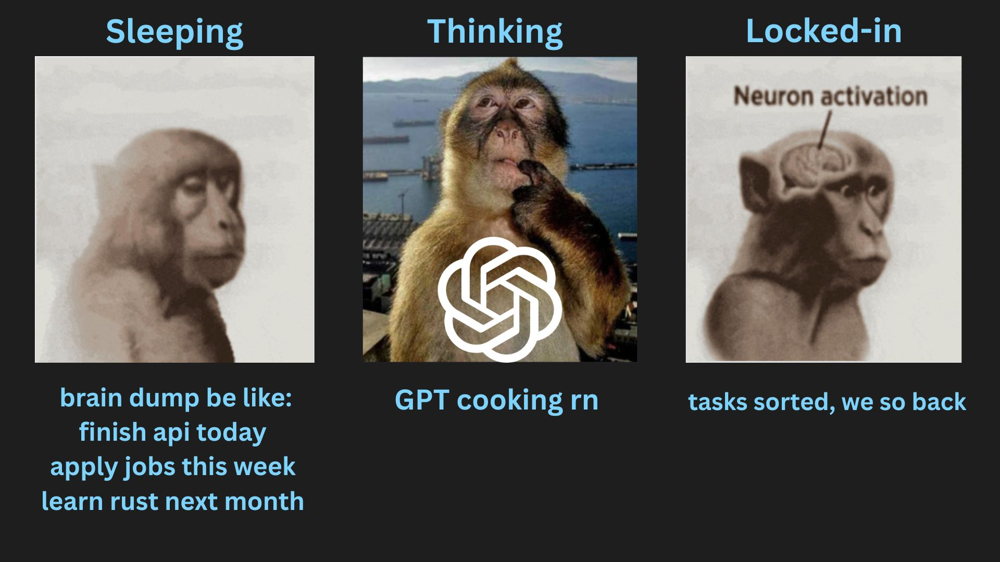

# vomit



raw thoughts → clean todos

A frictionless CLI task manager that transforms brain dumps into organized todos across timeframes. Built for developers who value simplicity over productivity app bloat.

## 🚀 Quick Start

```bash
# Clone and setup
git clone https://github.com/kushgbisen/vomit.git
cd vomit
python -m venv venv
source venv/bin/activate  # or venv\Scripts\activate on Windows
pip install -r requirements.txt

# Add your first task
python main.py add "Buy groceries" --timeframe today

# Check your tasks
python main.py status

# Or use the classic brain dump method
echo "finish api today, apply to jobs this week, learn rust this month" > _1_vomit.txt
# Then use your AI tool with PROMPT.md to organize
```

## 📋 Features

### Core Task Management
- **Add tasks** with auto-categorization: `vomit add "task" --timeframe today/week/month/year`
- **Remove tasks** with pattern matching: `vomit remove "pattern" --all`
- **Complete tasks** with checkbox toggling: `vomit complete "task"`
- **Search tasks** across all timeframes: `vomit search "pattern" --status completed`
- **Move tasks** between timeframes: `vomit move "task" --from today --to week`

### Smart Organization
- **Auto-categorization** based on timeframe keywords
- **Pattern matching** for flexible task management
- **Cross-timeframe search** with advanced filtering
- **Progress tracking** with visual indicators
- **Task validation** to ensure quality

### AI Integration
- **Universal prompt** works with any AI CLI tool
- **Brain dump processing** from `_1_vomit.txt`
- **Automatic task extraction** and organization
- **Timeframe detection** from natural language

## 🛠️ Installation

### From Source
```bash
git clone https://github.com/kushgbisen/vomit.git
cd vomit
python -m venv venv
source venv/bin/activate
pip install -r requirements.txt
```

### Dependencies
- Python 3.8+
- typer (CLI framework)
- rich (terminal formatting)
- Optional: AI CLI tool (Claude Code, Gemini CLI, etc.)

## 📁 File Structure

```
vomit/
├── _1_vomit.txt     # Brain dump everything here
├── _2_today.md      # Today's urgent tasks
├── _3_week.md       # This week's goals
├── _4_month.md      # This month's objectives
├── _5_year.md       # Long-term vision
├── main.py          # CLI entry point
├── core/            # Core functionality
├── commands/        # CLI commands
└── tests/           # Test suite
```

## 🎯 Usage Examples

### Basic Task Management
```bash
# Add tasks
vomit add "Finish API endpoint" --timeframe today
vomit add "Apply for jobs" --timeframe week
vomit quick "Learn Python"  # Auto-detects timeframe

# Complete tasks
vomit complete "API endpoint"
vomit toggle "Learn Python"  # Toggle completion

# Search tasks
vomit search "API" --all
vomit completed --days 7
vomit incomplete --timeframe week
```

### Advanced Operations
```bash
# Move tasks between timeframes
vomit move "Learn Python" --from month --to week
vomit promote "API endpoint" --timeframe week  # week → today
vomit demote "Big project" --timeframe today   # today → week

# Clean up completed tasks
vomit cleanup --timeframe today

# Check status and progress
vomit status --details
vomit progress --all
vomit overview
```

### AI-Powered Workflow
```bash
# 1. Brain dump
echo "need to finish api today, apply to jobs this week, learn rust this month" > _1_vomit.txt

# 2. Process with AI (setup once)
cp PROMPT.md CLAUDE.md  # For Claude Code
# or copy to your AI tool's config

# 3. Run AI processing
claude code  # or your preferred AI CLI

# 4. Check organized tasks
vomit status --all
```

## 🔧 Commands Reference

### Task Operations
- `vomit add "task" --timeframe today|week|month|year` - Add task
- `vomit quick "task"` - Quick add with auto-detection
- `vomit remove "pattern" --timeframe today --all` - Remove tasks
- `vomit complete "pattern" --exact` - Complete tasks
- `vomit uncomplete "pattern"` - Mark as incomplete
- `vomit toggle "pattern"` - Toggle completion status

### Search & Status
- `vomit search "pattern" --status completed --days 7` - Search tasks
- `vomit find "pattern"` - Quick search
- `vomit completed --timeframe today` - Show completed tasks
- `vomit incomplete --all` - Show incomplete tasks
- `vomit status --details` - Show task status
- `vomit progress --all` - Show progress bars
- `vomit overview` - Quick overview

### Organization
- `vomit move "pattern" --from today --to week` - Move tasks
- `vomit promote "pattern" --timeframe week` - Move to shorter timeframe
- `vomit demote "pattern" --timeframe today` - Move to longer timeframe
- `vomit cleanup --timeframe today` - Archive completed tasks

## 🧠 AI Integration

The `PROMPT.md` file contains a universal prompt that works with any AI CLI tool:

1. **Claude Code**: `cp PROMPT.md CLAUDE.md`
2. **Gemini CLI**: Copy prompt to config
3. **Qwen CLI**: Copy prompt to config
4. **Custom AI**: Adapt prompt as needed

The AI automatically:
- Extracts actionable tasks from brain dumps
- Categorizes by timeframe keywords
- Formats as markdown checkboxes
- Clears the brain dump file

## 🧪 Testing

```bash
# Run all tests
python -m pytest tests/ -v

# Run specific test file
python -m pytest tests/test_models.py -v

# Run with coverage
python -m pytest tests/ --cov=core --cov=commands
```

## 🎨 Philosophy

**Vomit** is built on these principles:
- **Frictionless**: Minimal keystrokes, maximum productivity
- **AI-First**: Designed for AI automation and human operation
- **Time-based**: Organize tasks naturally across time horizons
- **Simple**: No complex features, no bloat, no distractions
- **Extensible**: Clean architecture for future enhancements

Perfect for developers who want to capture thoughts quickly and let AI handle the organization.

---

*Built with ❤️ for productive developers*